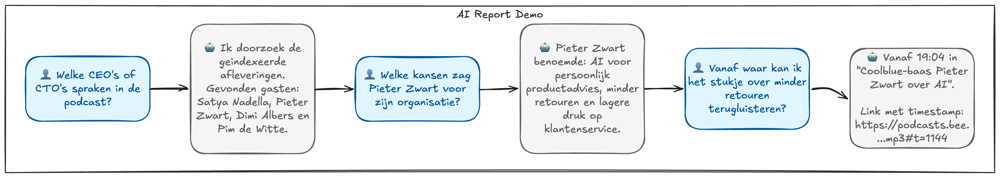
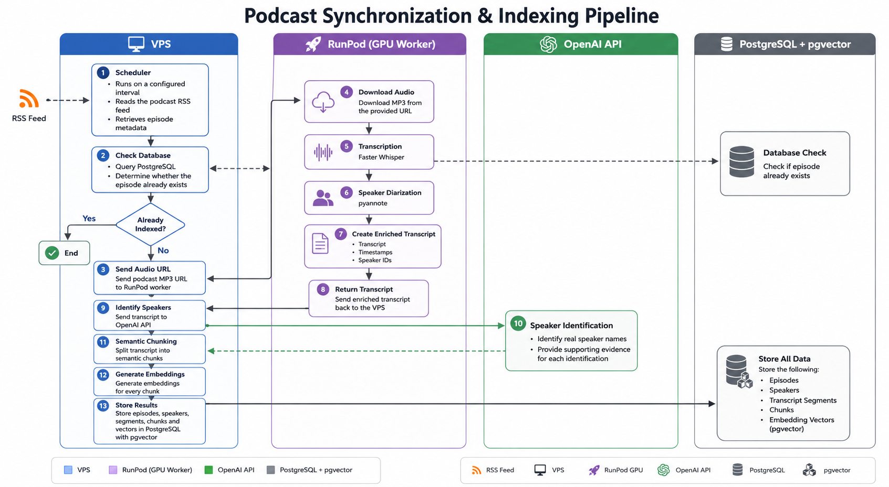

# Podcast MCP

Speaker-aware MCP server for searchable podcast transcripts.

This project indexes podcast episodes from an RSS feed, transcribes them, identifies speakers, stores semantic embeddings in Postgres/pgvector, and exposes read-only search and retrieval tools through MCP.

## Demo

This repository powers a concrete production deployment for **AI Report MCP**.



Public MCP endpoint:

```text
https://ai-report.bramdehart.nl/mcp
```

Demo bearer token:

```text
9b55e1de7f3e0e8972377d3d9a77330929f6446bccf0927ccc648bb0d512018c
```

Example questions:

- Welke afleveringen vind je?
- Zoek wat er gezegd werd over Satya Nadella.
- Wat zei Alexander over Anthropic?
- Geef transcriptcontext rond timestamp 12:34.

The demo endpoint is read-only and rate-limited.

## Synchronization flow




## MCP Tools

- `list_episodes` — list indexed podcast episodes.
- `get_episode` — fetch episode metadata and speaker mappings.
- `search_podcast_transcripts` — semantic search over transcript chunks.
- `get_transcript_around_timestamp` — get raw transcript context around a timestamp.
- `search_by_speaker` — search or list chunks by speaker.

## Tech Stack

- Python
- MCP Python SDK
- Postgres
- pgvector
- Docker Compose
- Hetzner VPS
- RunPod Serverless GPU workers
- Faster Whisper
- pyannote speaker diarization
- OpenAI embeddings, currently `text-embedding-3-small`
- OpenAI speaker-name mapping, currently `gpt-5.4-mini`
- Caddy for public HTTPS reverse proxy

## Repository Layout

```text
src/podcast_mcp/
  ingest/       RSS sync, scheduler, transcript ingest, speaker-name repair
  mcp/          MCP server and tool implementations
  runpod/       RunPod client and worker handler
  transcribe/   audio transcription and diarization pipeline

db/migrations/  Postgres schema
docs/           deployment and operation notes
```

## Local Usage

Install dependencies:

```bash
.venv/bin/pip install -r requirements.txt
```

List indexed episodes:

```bash
PYTHONPATH=src .venv/bin/python -m podcast_mcp.mcp.tools list-episodes
```

Run the MCP server locally:

```bash
PYTHONPATH=src .venv/bin/python -m podcast_mcp.mcp.server
```

For full setup, see the docs below.

## Documentation

- [MCP tools](docs/MCP.md)
- [RunPod worker](docs/RUNPOD.md)
- [Hetzner deployment](docs/HETZNER.md)
- [Project context](docs/PROJECT_CONTEXT.md)

## Speaker Attribution

Speaker names are inferred from diarization and transcript context. Tool consumers should account for `speaker_confidence`:

- `>= 0.85`: treat the speaker name as certain.
- `0.60-0.85`: phrase attribution as likely or probable.
- `< 0.60`: mention that the speaker identity is uncertain.

## Status

The code is intended to stay generic enough for any podcast RSS feed, while the demo deployment is a concrete implementation for one indexed podcast.
