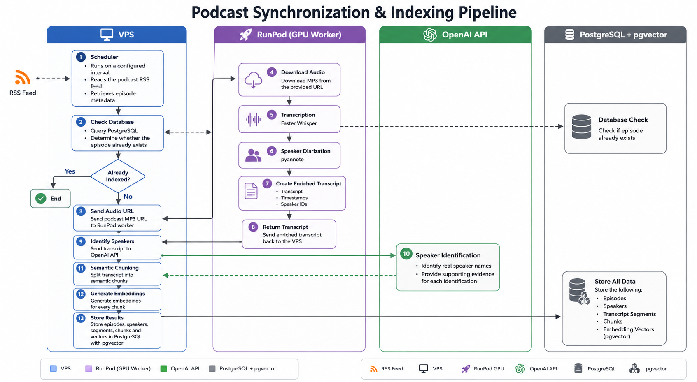

# Podcast MCP

Speaker-aware MCP server for searchable podcast transcripts.

Podcast MCP indexes podcast episodes from an RSS feed, transcribes them,
identifies speakers, stores semantic embeddings in Postgres/pgvector, and
exposes read-only search and retrieval tools through the [Model Context
Protocol](https://modelcontextprotocol.io/). Any podcast RSS feed can be
indexed; the code stays generic, while the [AI Report](https://www.aireport.nl/)
deployment is one concrete example.



## How it works

Podcast MCP runs two separate processes. Ingestion is offline and heavy and may
use GPUs; the MCP server is online, lightweight, and read-only.

### Process 1: Ingesting new episodes

```text
                 RSS feed
                    │  (polled on a schedule)
                    ▼
            ┌─────────────────────┐
            │  RSS sync           │   finds episodes not yet indexed
            └──────────┬──────────┘
                       │ audio URL
                       ▼
            ┌─────────────────────┐
            │  Transcription      │   Faster Whisper (RunPod GPU worker or local)
            └──────────┬──────────┘
                       ▼
            ┌─────────────────────┐
            │  Speaker diarization│   pyannote -> anonymous SPEAKER_00 labels
            └──────────┬──────────┘
                       ▼
            ┌─────────────────────┐
            │  Speaker name map   │   LLM resolves labels to names + confidence
            └──────────┬──────────┘
                       ▼
            ┌─────────────────────┐
            │  Chunk + embed      │   transcript chunks -> OpenAI embeddings
            └──────────┬──────────┘
                       ▼
            ┌─────────────────────┐
            │  Postgres + pgvector│   episodes, speakers, segments, chunks
            └─────────────────────┘
```

### Process 2: Calling the MCP server

```text
   Claude / Cursor / ChatGPT / any MCP client
                    │  MCP tool call (stdio or authenticated HTTP)
                    ▼
            ┌─────────────────────┐
            │  MCP server         │   thin tool handlers (server/tools)
            └──────────┬──────────┘
                       ▼
            ┌─────────────────────┐
            │  Application        │   use cases: search, episodes, speakers
            │  services           │
            └──────────┬──────────┘
                       ▼
            ┌─────────────────────┐
            │  Repository         │   read-only interface over transcript data
            │  (Postgres)         │
            └─────────────────────┘
                       │
                       ▼
            search / transcript results returned to the client
```

## Try the hosted demo

This repository powers a production deployment for
[AI Report](https://www.aireport.nl/). Over 170 hours of podcast episodes have
been indexed and new episodes are indexed automatically on release.

Public MCP endpoint:

```text
https://ai-report.bramdehart.nl/mcp
```

Demo bearer token:

```text
Bearer 9b55e1de7f3e0e8972377d3d9a77330929f6446bccf0927ccc648bb0d512018c
```

The demo endpoint is read-only and rate-limited.

## Real-world examples

Point any MCP client at the demo endpoint and ask questions in natural language.
The tools let the assistant list episodes, search semantically, zoom in on a
timestamp, and filter by speaker.

### Example 1: What is this podcast about?

> Welke afleveringen vind je? Wat zijn de laatste onderwerpen die aan bod zijn
> gekomen?

The assistant lists recent episodes and their metadata to orient itself.

### Example 2: Semantic recall

> Zoek wat er werd gezegd over Satya Nadella.

A semantic search (`search_podcast_transcripts`) retrieves the transcript
chunks whose meaning is closest to the query, together with the episode,
timestamps, speaker, and similarity score.

### Example 3: Speaker-aware search

> Wat zei Alexander over Anthropic?

`search_by_speaker` narrows the search to chunks attributed to Alexander,
combining the speaker filter with semantic ranking.

### Example 4: Timestamp context

> Geef transcriptcontext rond timestamp 12:34 van de aflevering over AI
> agents.

`get_transcript_around_timestamp` returns the raw transcript segments around
that timestamp so the assistant can quote the exact wording.

### Example 5: Speaker confidence matters

> Wie waren de gasten in de aflevering van vorige week, en kunnen we zeker
> weten wie wat zei?

The assistant lists the episode speakers (`get_episode`) and reports the
`speaker_confidence` for each attribution, using the guidance below.

## MCP tools

- `list_episodes` — list indexed podcast episodes.
- `get_episode` — fetch episode metadata and speaker mappings.
- `search_podcast_transcripts` — semantic search over transcript chunks.
- `get_transcript_around_timestamp` — raw transcript context around a timestamp.
- `search_by_speaker` — search or list chunks by speaker.

## Features

- Reads any podcast RSS feed and indexes only new episodes.
- Full offline ingestion pipeline: download, transcribe, diarize, name
  speakers, chunk, embed, store.
- GPU transcription on RunPod Serverless (or locally).
- Speaker-name resolution backed by an LLM with confidence scores and evidence.
- Semantic search with pgvector.
- Read-only, authenticated MCP server over stdio or HTTP.

## Installation

Requires Python 3.12+.

```bash
python3.12 -m venv .venv
.venv/bin/pip install -e ".[server,ingestion]"
cp .env.example .env
```

Dependencies are split so a plain MCP server install stays small:

| Group | Purpose |
| ----- | ------- |
| `server` | MCP server: `mcp`, `uvicorn`. |
| `ingestion` | RSS sync, scheduler, ingest: `croniter`. |
| `worker` | GPU transcription/diarization: `faster-whisper`, `pyannote.audio`, `runpod`. |
| `dev` | `ruff`, `pytest`, `mypy`. |

Install only what you need, e.g. `pip install -e ".[worker]"` on a GPU worker.

## Quick start

Run the MCP server over stdio:

```bash
podcast-mcp
```

Query transcripts from the command line:

```bash
podcast-mcp-tools list-episodes
podcast-mcp-tools search "wat werd er gezegd over Anthropic?"
```

Ingest new episodes once, or on a schedule:

```bash
podcast-mcp-ingest        # one RSS sync
podcast-mcp-scheduler     # sync on SYNC_CRON
```

Start a local Postgres with pgvector:

```bash
docker compose up -d postgres
```

## Speaker attribution

Speaker names are inferred from diarization and transcript context. Tool
consumers should account for `speaker_confidence`:

- `>= 0.85`: treat the speaker name as certain.
- `0.60-0.85`: phrase attribution as likely or probable.
- `< 0.60`: mention that the speaker identity is uncertain.

## Documentation

- [Architecture](docs/architecture.md)
- [Configuration](docs/configuration.md)
- [Development](docs/development.md)
- [MCP server and tools](docs/mcp.md)
- Deployment: [Docker](docs/deployment/docker.md), [RunPod](docs/deployment/runpod.md), [Hetzner](docs/deployment/hetzner.md)
- [AI Report deployment example](examples/ai-report/README.md)
- [Security](SECURITY.md)

## Tech stack

- Python
- MCP Python SDK
- Postgres + pgvector
- Docker Compose
- RunPod Serverless GPU workers
- Faster Whisper
- pyannote speaker diarization
- OpenAI embeddings (`text-embedding-3-small`) and speaker-name mapping
- Caddy for public HTTPS reverse proxy

## Repository layout

```text
src/podcast_mcp/
  server/           MCP server and thin tool handlers
  application/      use cases (search, episodes, speakers)
  domain/           entities (Episode, Speaker, TranscriptChunk, ...)
  infrastructure/   Postgres repository, embeddings, RunPod adapter
  ingest/           RSS sync, scheduler, transcript ingest, transcription

db/migrations/      Postgres schema
docs/               architecture, configuration, development, deployment
examples/ai-report/ concrete production deployment (AI Report demo)
```

## Status

The code is intended to stay generic for any podcast RSS feed. The demo
deployment on [AI Report](https://www.aireport.nl/) is a concrete
implementation for one indexed podcast and lives in `examples/ai-report/`.