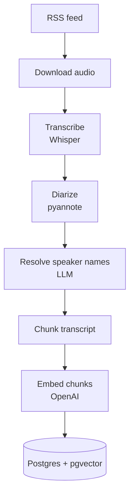
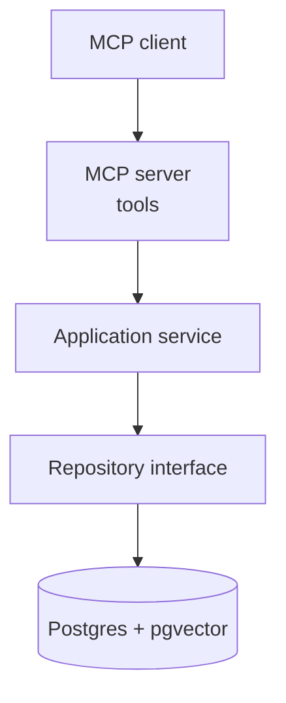
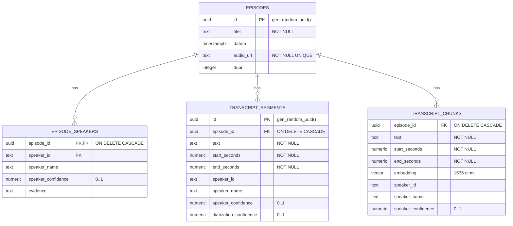

# Architecture

## What this project does

The system:

1. Reads a podcast RSS feed.
2. Detects episodes that are not yet indexed.
3. Sends each new episode audio URL to a transcription worker (local, RunPod, or any adapter).
4. Transcribes audio with Whisper / faster-whisper.
5. Performs speaker diarization with pyannote.
6. Resolves anonymous speaker labels to names using an LLM (OpenAI by default).
7. Chunks transcript segments.
8. Creates OpenAI embeddings for chunks.
9. Stores episodes, speakers, segments, chunks, and vectors in Postgres/pgvector.
10. Exposes read-only search and retrieval tools through MCP.

## Layered package structure

The package is split into clear layers so the MCP interface stays independent of
storage and processing details.

```text
src/podcast_mcp/
├── server/           MCP server and read-only tool implementations
│   ├── server.py     FastMCP server (stdio / streamable-http / sse)
│   └── tools/        thin tool handlers, one module per concern
├── application/      use cases: episodes, search, speakers
├── domain/           entities: Episode, Speaker, TranscriptChunk, ...
├── infrastructure/   adapters: Postgres repository, embeddings, RunPod client/worker
└── ingest/           offline pipeline: RSS sync, scheduler, transcript ingest,
                      speaker-name repair, transcription pipeline
```

Layering rules:

- `server` calls `application` only.
- `application` calls `infrastructure` through interfaces (`Protocol`).
- `infrastructure` is swappable (Postgres today; Qdrant, SQLite, etc. later).
- `ingest` is a separate offline workload and is never imported by the server path.

## High-level architecture


Current deployment split (AI Report):

- Hetzner VPS:
  - Postgres with pgvector
  - RSS scheduler
  - RunPod client / orchestrator
  - speaker-name resolution
  - transcript ingest
  - embeddings
  - MCP service
  - Caddy reverse proxy
- RunPod:
  - audio download
  - faster-whisper transcription
  - pyannote diarization
  - returns transcript JSON to Hetzner

## Two runtime workloads

### 1. Ingestion (offline, heavy)



This workload may use GPUs and pull in `faster-whisper`, `pyannote.audio`,
`torch`, and friends. It is installed via the `worker` dependency group.

### 2. Serving (online, light)



This workload is small, fast, and has no GPU dependencies. It is installed via
the `server` dependency group.

## Database model



- `episodes` — one row per indexed podcast episode, unique by `audio_url`.
- `episode_speakers` — speaker labels per episode (`speaker_id`, `speaker_name`,
  `speaker_confidence`, `evidence`).
- `transcript_segments` — raw transcript segments with timestamps and speaker
  metadata; used for timestamp-based context retrieval.
- `transcript_chunks` — grouped segments formatted with speaker labels and
  timestamps, each with a `vector(1536)` embedding; used for semantic search.

Chunks are a derived aggregate of consecutive segments. `speaker_name` /
`speaker_id` on a chunk are only set when all segments in the chunk share one
speaker, otherwise they are `NULL`.

Indexes:

- `idx_transcript_chunks_embedding` — pgvector `ivfflat` on
  `transcript_chunks.embedding` (cosine, 100 lists).
- `idx_transcript_chunks_episode_id`, `idx_transcript_segments_episode_id`,
  `idx_episode_speakers_episode_id` — btree on `episode_id`.
- `idx_transcript_segments_speaker` — btree on `(episode_id, speaker_id)`.

The full DDL lives in `db/migrations/`.

## MCP tools

Current tools:

- `search_podcast_transcripts` — semantic search over transcript chunks.
- `get_episode` — episode metadata and speaker mappings.
- `get_transcript_around_timestamp` — raw transcript context around a timestamp.
- `list_episodes` — list indexed episodes.
- `search_by_speaker` — search or list chunks spoken by a speaker.

The MCP service supports:

- `stdio` for local MCP clients.
- `streamable-http` and `sse` for remote/public MCP access.
- Bearer token auth via `MCP_BEARER_TOKEN`.
- In-memory IP rate limiting via `MCP_RATE_LIMIT_REQUESTS` and
  `MCP_RATE_LIMIT_WINDOW_SECONDS`.

## Known design choices

- Transcription runs off the serving path, on a worker (RunPod by default).
- Speaker-name resolution happens after transcription via the OpenAI API.
- Embeddings use OpenAI `text-embedding-3-small` (1536 dimensions).
- Speaker-name mapping can be repaired after ingest with
  `podcast-mcp-speaker-names`.
- Public MCP access uses a bearer token rather than per-user registration.
- IP rate limiting is in-memory and suitable for one VPS / one MCP container.

## Known issues and caveats

- Chunked diarization means one real person may have multiple `speaker_id`
  labels across chunks.
- Claude Desktop may not support remote HTTP MCP directly; `mcp-remote` can
  bridge it.
- ChatGPT custom GPTs do not directly consume arbitrary MCP endpoints; a
  REST/OpenAPI wrapper is the practical route for GPT Actions.